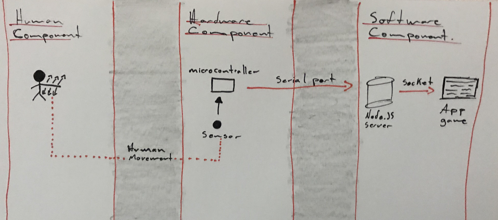

# Rehabilitation game

## About
On December, 2019 I, sadly, dislocated my shoulder. 

During the recovery process, as part of the therapy, my doctor recommended to make some movements (codman exercises) but it was extremely boring. Subsequently, I decided to make the recovery fun and interactive.

Based on that, I took the human movement and mixed with hardware and software for create a rehabilitation game. 

## How it works
In the solution, there is three components and in the practical way, each component is represented by:

* Human Component: For make the action. 
* Hardware Component: For indentify the human action.
* Software Component: For interpretade the action.

In this case, putting the sensor on my bicep and moving my shoulder, I can be able to make the T-Rex jump and in this way, I can do the rehabilitation session while I play 

## Solution Architecture

How it has been saying, there are three principal components, but two of the principals components are composed for others pieces who allow the correct functionality of the solution:

* Hardware Component

    * Acceletometer: Is a sensor for indentify movements in the axis X, Y and Z.

    * Microcontroller: Read the data from the sensor and send it to the server in case the data satisfy with the conditions

* Software Component
    * Server: Read data from the microcontroller and send it to the game

    * Game : Read data from server and implement it in the game

The flow of the data is one-direction. From the Human component to Hardware and then, to the Software one. Additionaly, there is used others pieces as a bridge for the data submission:

* Serial Port: Allow transfer data between the microcontroller to the server
* Sockets: Allow transfer data between the server to the game application

## Next steps 

Currently, I'm having ongoing conversations and running tests with several doctors in a rehabilitation center to help injured patients with this solution.

Also, with that conversations we discover that it can be used in patient with different injured that mine, for example, it can be used in patients with chronic injured.

All of that allow the project to move to create an open community for give more game options to the future users of the solution 

## More information

If you are thinking in contribute in the open source community or you want to know more about the project, you can write me a message to the following email: lopezjimenezmauro05@gmail.com

## -- project still under development --

